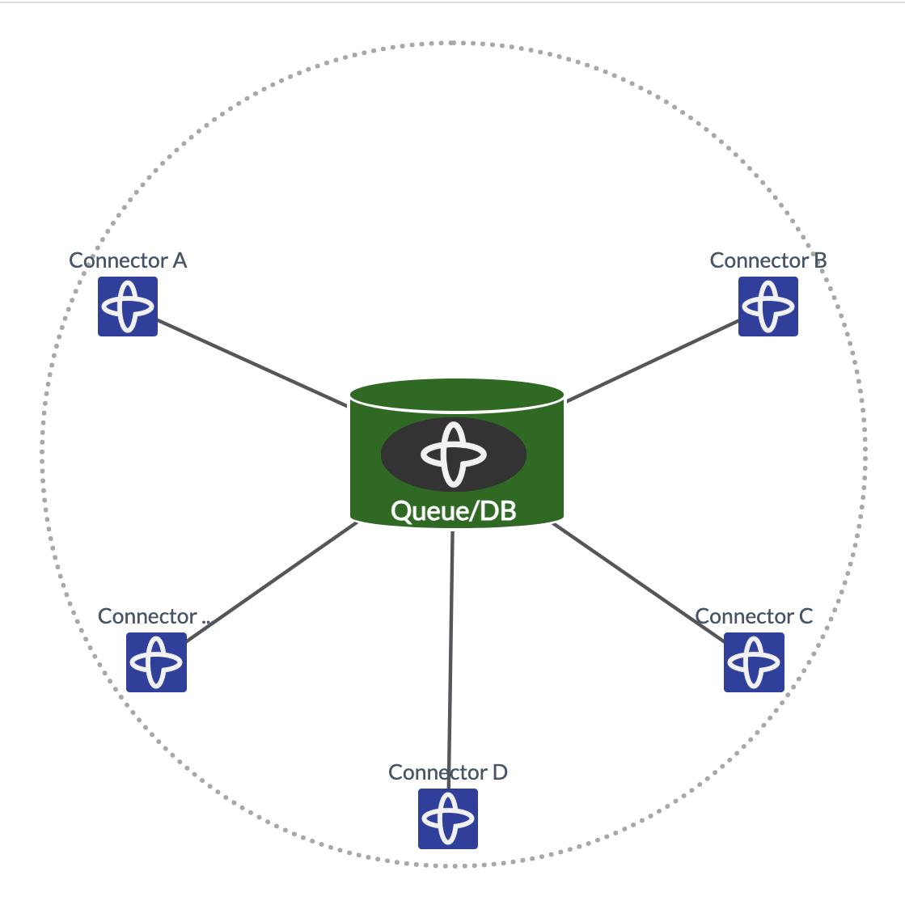
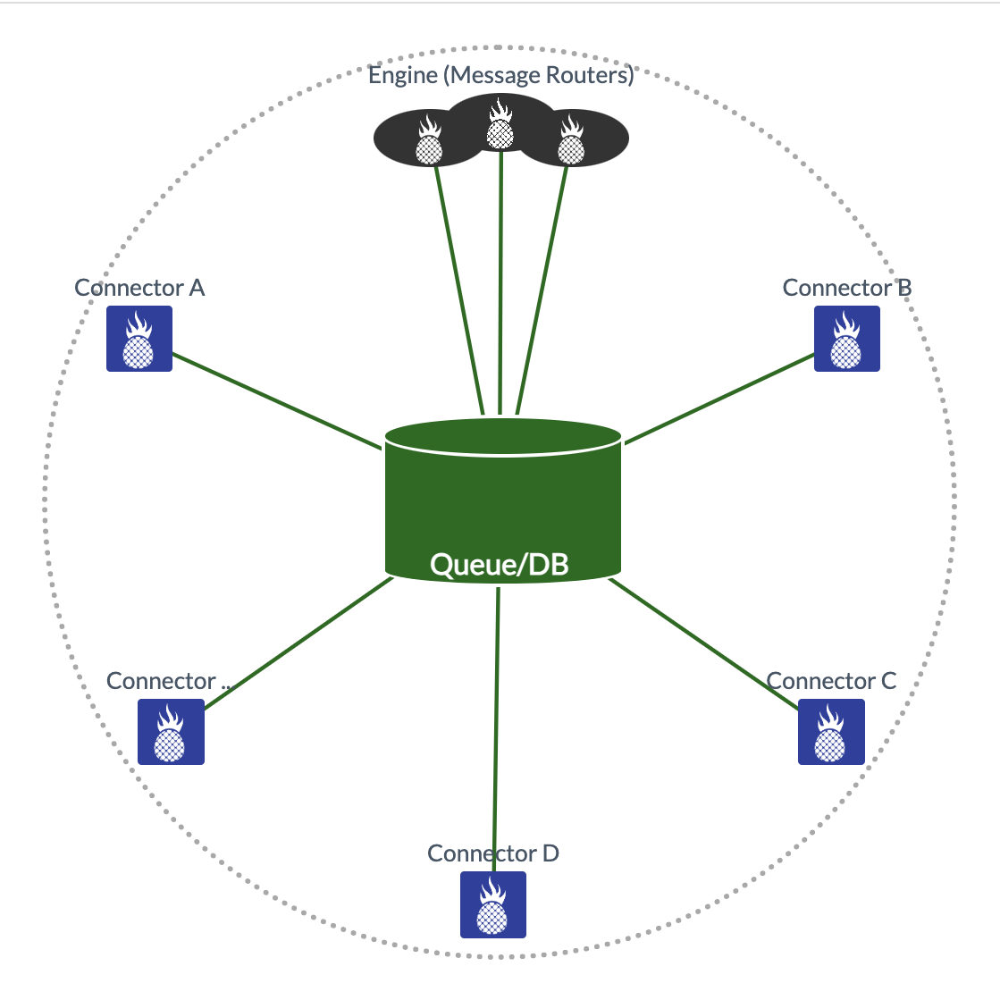

# Apples to Apples: Temporal vs HotMesh vs MeshFlow

The 3 modules in the examples/ directory run the same workflow using a different engine. The inputs and outputs are the same for all 3 examples. It is meant to show how the same workflow can be run on different engines.

- `temporal` Temporal is a workflow engine that runs on a central app server.
- `hotmesh` HotMesh is a workflow engine that runs without a central app server.
- `meshflow` Meshflow is HotMesh's emulation of Temporal's workflow engine.


Although the APIs are the same, HotMesh is serverless and uses decentralized message routers. The backend is pluggable and interchangeably supports Postgres, Redis, and NATS.

| Temporal | HotMesh |
|:--------:|:-------:|
|  |  |

## Getting Started

### Requirements
- [Node.js](https://nodejs.org/)
- [Docker](https://www.docker.com/)

### Installation

1. **Clone the Repository**
   ```bash
   git clone https://github.com/hotmeshio/temporal-side-by-side-typescript.git
   cd temporal-side-by-side-typescript
   ```
2. **Install** the dependencies
    ```bash
    npm install
    ```
3. **Startup Docker**
    ```bash
    npm run docker:up
    ```
4. **Shutdown Docker**
    ```bash
    npm run docker:down
    ```
5. **Cleanup Docker**
    ```bash
    npm run docker:reset
    ```

Test Temporal by running an HTTP GET once the container loads:
```bash
curl http://localhost:3010/api/v1/test/temporal
```

Test HotMesh by running an HTTP GET once the container loads:
```bash
curl http://localhost:3010/api/v1/test/hotmesh
```

Test MeshFlow by running an HTTP GET once the container loads:
```bash
curl http://localhost:3010/api/v1/test/meshflow
```

Test all 3 engines by running an HTTP GET once the container loads:
```bash
curl http://localhost:3010/api/v1/test
```
