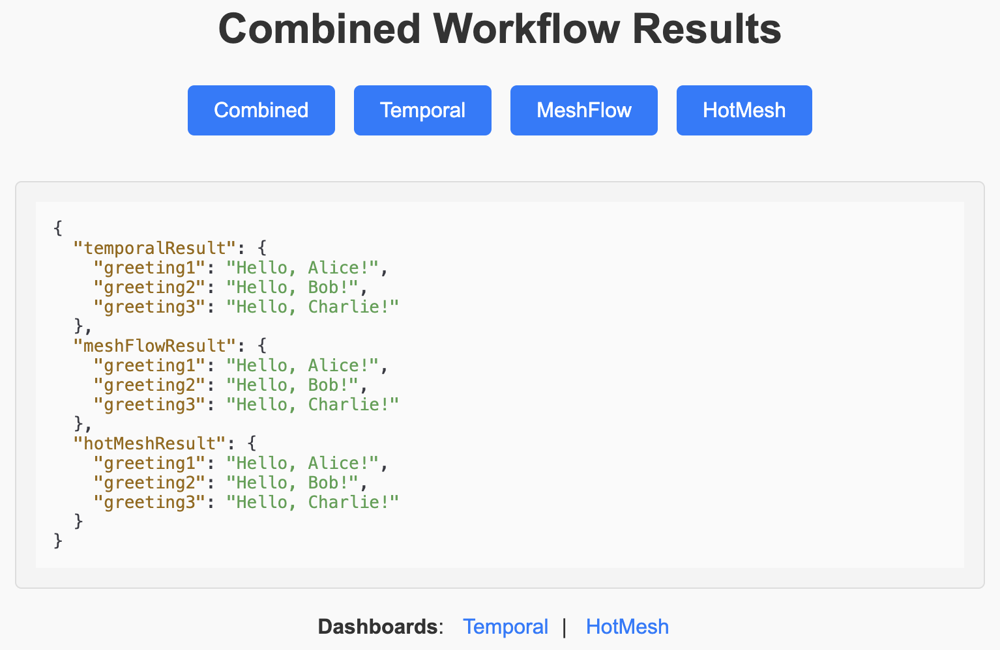

# Apples to Apples: Temporal vs HotMesh vs MeshFlow

The `examples/` directory includes three modules that execute the same workflow using different engines. Each module produces identical output, showcasing how the same workflow can be implemented across these engines:

- **`Temporal`**: Temporal is a workflow engine that operates on a central app server.
- **`HotMesh`**: HotMesh is a serverless workflow engine leveraging decentralized message routers.
- **`MeshFlow`**: MeshFlow is HotMesh’s emulation of Temporal’s workflow engine (also serverless).

| Temporal | HotMesh/MeshFlow |
|:--------:|:-------:|
|  |  |

## Getting Started

### Requirements
- [Node.js](https://nodejs.org/)
- [Docker](https://www.docker.com/)

### Installation

1. **Clone the Repository**
   ```bash
   git clone https://github.com/hotmeshio/temporal-comparison-typescript.git
   cd temporal-comparison-typescript
   ```
2. **Install Dependencies**
    ```bash
    npm install
    ```
3. **Start Docker**
    ```bash
    npm run docker:up
    ```
4. **Stop Docker**
    ```bash
    npm run docker:down
    ```
5. **Cleanup Docker**
    ```bash
    npm run docker:reset
    ```

### Test Harness

You can run and compare the engines by opening the test harness landing page: `http://localhost:3010/api/v1/test`. The harness includes links to the dashboard for each engine and optional telemetry links if a telemetry sink is configured.



### Engine Dashboards

Temporal and HotMesh Dashboards are available at:
- `temporal` http://localhost:8080/
- `hotmesh` http://localhost:8118/workflows

## Additional Resources

- **[SDK Documentation](https://docs.hotmesh.io)**: Comprehensive documentation and examples for all patterns.
- **[NPM Package](https://www.npmjs.com/package/@hotmeshio/hotmesh)**: Download the HotMesh package.
- **[Contribution Guidelines](./docs/CONTRIBUTING.md)**: Instructions for contributing to the project.

## License

This project is licensed under the Apache 2.0 License. See the LICENSE file for details.

## Disclaimer

This project is not affiliated with, endorsed by, or sponsored by Temporal Technologies, Inc. Temporal is a trademark of Temporal Technologies, Inc., and all references to Temporal and related technologies are for educational and demonstration purposes only.
